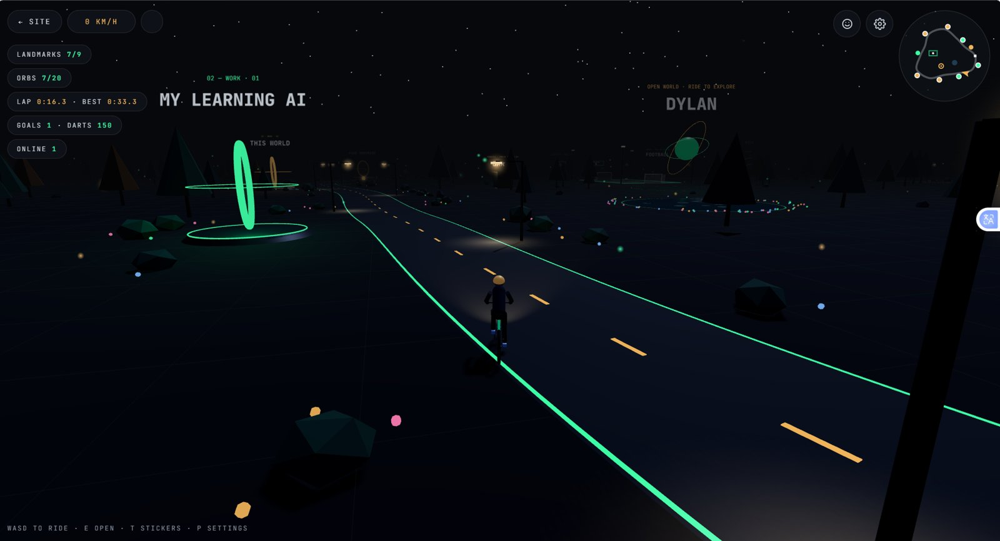

<div align="center">

```
 ██████╗ ██╗   ██╗██╗      █████╗ ███╗   ██╗
 ██╔══██╗╚██╗ ██╔╝██║     ██╔══██╗████╗  ██║
 ██║  ██║ ╚████╔╝ ██║     ███████║██╔██╗ ██║
 ██║  ██║  ╚██╔╝  ██║     ██╔══██║██║╚██╗██║
 ██████╔╝   ██║   ███████╗██║  ██║██║ ╚████║
 ╚═════╝    ╚═╝   ╚══════╝╚═╝  ╚═╝╚═╝  ╚═══╝   / 00
```

### `> portfolio + a 3D world you can ride through_`

[](https://dylanashleyalves.github.io/dylan-portfolio/)
[](https://dylanashleyalves.github.io/dylan-portfolio/world.html)
[](https://www.linkedin.com/in/dylan-alves-757831281)


<br/>



<sub><code>// riding past the "My Learning AI" landmark · HUD, minimap and all</code></sub>

</div>

<br/>

## 👋 `whoami`

```js
const dylan = {
  role:      "Software Engineer",
  location:  "Singapore 🇸🇬",
  education: "Diploma in Computer Engineering · Temasek Polytechnic (2026)",
  builds:    "practical apps powered by AI",
  loves:     ["coding", "teaching", "darts 🎯", "football ⚽", "the gym 💪"],
  status:    "Serving National Service until 2028",
  openTo:    "software & AI roles after NS · happy to connect now",
};
```

<br/>

## 🗂️ `ls ./features`

<table>
<tr>
<td width="50%" valign="top">

### 🌐 The portfolio — `index.html`

- 🎬 Projects with **demo videos** and screenshot slideshows
- 🧭 Career path, achievements & **verifiable certs**
- 📸 "Life" gallery: darts, fitness and more
- ✉️ Working contact form

</td>
<td width="50%" valign="top">

### 🚲 The 3D world — `world.html`

- 🛣️ Ride a bike to **9 landmarks** of my work
- 🛂 Passport stamps, 🔮 20 hidden orbs, ⏱️ lap timer
- ⚽ Football pitch · 🎯 darts (301/501/701, Cricket)
- 😎 Unlockable **sticker emotes**
- 👥 **Live multiplayer** riders
- 🎵 Original generative music · ⚙️ retro settings

</td>
</tr>
</table>

<details>
<summary><b>🎮 Controls</b> <sub>(click to expand)</sub></summary>
<br/>

| Key | Action |
|:---:|---|
| `W` `A` `S` `D` / arrows | Ride and steer |
| `E` | Open a landmark · play darts |
| `B` · `L` · `C` | Bell · headlight · camera view |
| `T` / `1`–`0` | Sticker wheel · quick emotes |
| `P` / `Esc` | Settings (pauses the ride) |
| 📱 Phone | On-screen pads |

</details>

<details>
<summary><b>🎯 Darts game modes</b> <sub>(click to expand)</sub></summary>
<br/>

| Mode | Goal | Stat |
|---|---|---|
| **Practice** | Highest score with 3 darts | Best round |
| **301 / 501 / 701** | Count down to exactly zero. Go under and you bust. | PPD |
| **Cricket** | Close 20–15 and the bull | MPR |

</details>

<br/>

## 🛠️ `cat stack.json`

```json
{
  "site":        ["HTML", "CSS", "JavaScript", "Tailwind CSS"],
  "3d-world":    ["Three.js (WebGL)", "Web Audio API"],
  "multiplayer": "Supabase Realtime (presence + broadcast)",
  "forms":       "Formspree",
  "analytics":   "GoatCounter (privacy-friendly, no cookies)",
  "hosting":     "GitHub Pages"
}
```

<br/>

## 📁 `tree`

```bash
dylan-portfolio/
├── index.html        # portfolio homepage
├── world.html        # 3D world (styles + game code in one file)
├── css/styles.css    # custom homepage styles
├── js/main.js        # gallery, slideshows, contact form
├── images/           # portrait, screenshots, gallery, stickers
└── videos/           # project demo videos
```

<br/>

## 🚀 `npm run dev` <sub>(well… not quite)</sub>

No build step and no installs. It's plain HTML, CSS and JS.

```bash
# 1. clone it
git clone https://github.com/dylanashleyalves/dylan-portfolio.git
cd dylan-portfolio

# 2. open the folder in VS Code
code .

# 3. right-click index.html → "Open with Live Server"
```

> [!NOTE]
> The 3D world loads Three.js from a CDN, so it needs internet. Use a local server rather than double-clicking the files.

<details>
<summary><b>⚙️ Configuration</b> <sub>(click to expand)</sub></summary>
<br/>

| What | Where | Setting |
|---|---|---|
| Analytics | `index.html`, `world.html` | `data-goatcounter` script tag |
| Contact form | `js/main.js` | `CONTACT_FORM_URL` |
| World guestbook | `world.html` | `GUESTBOOK_URL` |
| Multiplayer | `world.html` | `SUPABASE_URL`, `SUPABASE_KEY` |

> [!WARNING]
> Only ever use Supabase's **publishable** key in front-end code, never the secret key.

</details>

<br/>

## 🙏 `credits`

- 🧊 [Three.js](https://threejs.org/), the 3D engine
- 🔤 [JetBrains Mono](https://www.jetbrains.com/lp/mono/) & [Silkscreen](https://fonts.google.com/specimen/Silkscreen) fonts
- 🎵 Background music is generated live in code, so it's original to this project

## 📜 `license`

```diff
+ The code is free to read and learn from.
- Photos, videos, stickers and personal content are mine. Please don't reuse them without permission.
```

<br/>

<div align="center">

<sub><code>// crafted in the quiet hours · © 2026 Dylan Ashley Alves</code></sub>

</div>